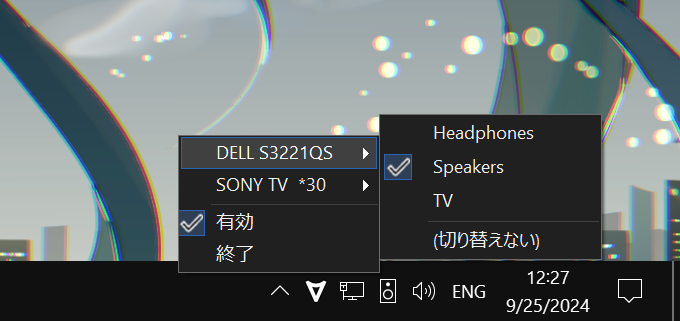

[English](README.md)

# オートオーディオスイッチャー

フォーカスされたウィンドウのモニターによって既定の再生デバイスを切り替える。

例えば、メディアプレーヤーを開いてWin+Shift+←→でテレビに移動させると、再生デバイスは自動的にテレビに切り替わる。Alt+Tabでプライマリディスプレイに戻れば再生デバイスがスピーカーに戻る。

## インストール

[**AutoAudioSwitcher-Setup.exeをダウンロード**](https://github.com/maxkagamine/AutoAudioSwitcher/releases/latest/download/AutoAudioSwitcher-Setup.exe)

## 使用上のメモ

- 各モニターの再生デバイスは、トレイアイコンを右クリックするか、exeと同じフォルダーにあるappsettings.jsonを編集することで設定できる（プログラムを実行すると接続されたモニターの名前が含まれたファイルが作成される。変更は自動で反映されるので、アプリを再起動する必要がない）

- 同じ名前のスピーカーが複数ある場合は、サウンドコントロールパネルから名前を変更できる（音量アイコンを右クリック → サウンド → 再生、または Win+R「mmsys.cpl」）。同じ名前のモニターの場合は、[#6](https://github.com/maxkagamine/AutoAudioSwitcher/issues/6)を見てください。

- このプログラムはフォーカスされたウィンドウが変わるたびではなく、現在のモニターが変わるときのみ既定の再生デバイスを変更する。つまり、メインモニターがスピーカーに設定されていて手動でヘッドフォンに切り替えた場合、そのモニターにいる限りスピーカーに戻ってしまうことはしない。自動切り替えを一時的に無効にしたい場合は、トレイアイコンを左クリックしてトグルできる。

- バグやクラッシュは[イシューで報告して](https://github.com/maxkagamine/AutoAudioSwitcher/issues/new)、exeと同じフォルダーにあるエラーログを添付してください（appsettings.jsonのLogLevelを"Debug"に変更すれば役立つかもしれない）

## 法的事項

Copyright © 鏡音マックス  
[Apache License 2.0](LICENSE.txt)の下でライセンスされています

## 違法事項

[海賊！](https://www.youtube.com/watch?v=NSZhIAfR6dA)
