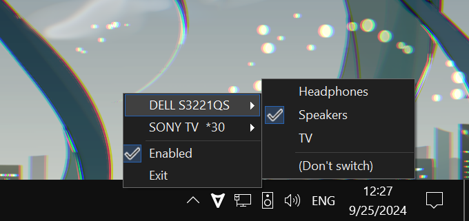

[日本語](README.ja.md)

# Auto Audio Switcher

Switches the default playback device based on the focused window's monitor.

For example, if you open a media player and Win+Shift+Left/Right it over to the TV, the playback device will automatically change to the TV. Alt+Tab back to the primary display, and the playback device switches back to the speakers.

## Installing

[**Download AutoAudioSwitcher-Setup.exe**](https://github.com/maxkagamine/AutoAudioSwitcher/releases/latest/download/AutoAudioSwitcher-Setup.exe)

## Usage notes

- The playback device for each monitor can be set either by right-clicking the tray icon or by editing appsettings.json in the same folder as the exe (it will be created and populated with the connected monitors' names when you run the program; changes are picked up automatically, so there's no need to restart the app).

- If you have multiple speakers with the same name, you can rename them from the Sounds control panel (right click on the volume icon > Sounds > Playback, or Win+R "mmsys.cpl"). In the case of duplicate monitors, see [#6](https://github.com/maxkagamine/AutoAudioSwitcher/issues/6).

- The program only changes the default playback device when the current monitor _changes_, not every time you switch windows, which means if your main monitor is set to Speakers and you manually switch to Headphones, it won't switch back to Speakers on you as long as you stay on that monitor. If you need to temporarily disable auto-switching, left click on the tray icon to toggle it on and off.

- Report bugs and crashes by [creating an issue](https://github.com/maxkagamine/AutoAudioSwitcher/issues/new). Be sure to attach the error log, found in the same folder as the exe. (Changing "LogLevel" in appsettings.json to "Debug" may help nail down the problem.)

## Legal stuff

Copyright © Max Kagamine  
Licensed under the [Apache License, Version 2.0](LICENSE.txt)

## Illegal stuff

[Pirates!](https://www.youtube.com/watch?v=NSZhIAfR6dA)
